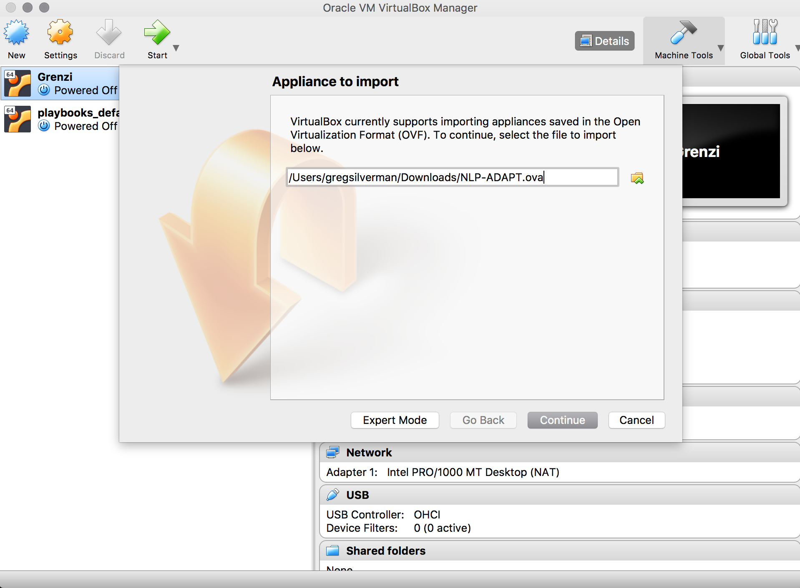
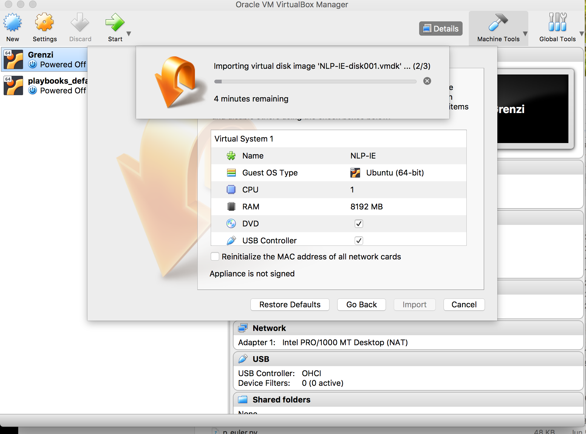

# University of Minnesota NLP-ADAPT (Artifact Discovery and Preparation Toolkit)

* [University of Minnesota NLP-ADAPT (Artifact Discovery and Preparation Toolkit)](#university-of-minnesota-nlp-adapt-artifact-discovery-and-preparation-toolkit)
    * [Table of Contents](#table-of-contents)
        * [Installation](#installation)
            * [Download OVA](#download-ova)
            * [Set File Share for Analysis](#set-file-share-for-analysis)
            * [Of Note](#of-note)
        * [Using the Software](#using-the-software)
            * [Open The VM](#open-the-vm)
            * [Run Annotator Systems](#run-annotator-systems)
            * [Run NLP-TAB](#run-nlp-tab)
            * [Run Amicus](#run-amicus)
        * [Known Issues](#known-issues)
        * [Future Work](#future-work)
            * [Software](#software)

NLP-ADAPT is configured with a wide variety of tools that can be used to annotate free-form medical texts and browse the output. These include the annotator engines: BiomedICUS, Metamap, cTAKES; the annotation browser NLP-TAB; and the annotation compatibility engine Amicus.

NLP-ADAPT is distributed as an `.ova` file, which is a computer image format that works with both VirtualBox and VMWare (NB: .ova formatted VMs can be ported to Vagrant box formatted files). We do recommend using VirtualBox, and the following instructions assume you have VirtualBox installed (if not, you can download it here: https://www.virtualbox.org/wiki/Downloads). 

The host system on which NLP-ADAPT is to be installed should have at least 8 gigabytes of RAM and a modern processor. You can expect that for each annotator system that the minimum run time for 10K documents will be about hour.

## Installation

### Download OVA

Download NLP-ADAPT image: You will be sent a link to download the image, NLP-ADAPT.ova, from Google Drive (this will take about an hour over wifi).

Move `NLP-ADAPT.ova` to a known folder and then open `NLP-ADAPT.ova` with VirtualBox. This can be done through the VirtualBox GUI using the <File><Import Appliance> menu option (see Fig. 1):
    

*Fig. 1: Using the GUI to select the source .OVA file to create a VM Appliance*

&nbsp; &nbsp;
Next, choose the file `NLP-ADAPT.ova` you have downloaded and then click on `Continue>Import>`. You should get a progress bar showing the status of building the VM (see Fig. 2):



*Fig. 2: GUI VM Appliance creation status*

&nbsp; &nbsp;
Alternately, from the command line you can import the `NLP-ADAPT.ova` as an appliance by simply typing the command:

`vboxmanage import /path/to/NLP-ADAPT.ova`. Once initiated, you will see output with status at the bottom of you terminal window (see Fig. 3):


*Fig. 3: Sample command line creation of VM Appliance*

&nbsp; &nbsp;
After this step is done NLP-ADAPT will be available from the VirtualBox GUI (see Fig. 4), or via the command line, using the command: `vboxmanage list vms`.


*Fig. 4: GUI display of available VM appliances*

&nbsp; &nbsp;
### Set File Share for Analysis

Next, you will need to configure NLP-ADAPT to have access to a shared data folder on the local host computer, that will be used for holding text records for analysis by the annotator systems.

The shared folder used for analysis should contain (as a subfolder) a single directory named `data_in`. The output of each annotator system on NLP-ADAPT will be added to the shared folder as `<system>_out`, after each system has processed the data.

To configure a shared drive, from the VM "Settings" menu:

Select NLP-ADAPT from the list and navigate to `Settings>Shared
Folders>`. There should be a folder icon with a green plus sign on it. Click on this
to add the shared folder. Select the location of data on the local host computer (i.e., the parent folder of `data_in`) for "Folder Path", and in the "Folder Name" field type "data" (see Fig. 5):


*Fig. 5: Configuring share folder on host*

&nbsp; &nbsp;
You can also do this from the command line using the command:
`vboxmanage sharefolder add "NLP-ADAPT" --name "data" --hostpath
"/path/to/data_in_parent_folder"` to give the VM access to the host filesystem. Please note; The parent folder with “data_in” subfolder can be anywhere on the host computer, but the share /MUST/ be named "data" in order for the VM to run without modification.

### Of Note

These systems work out-of-the-box if using a single flat folder with no sub-folders for `data_in`. While a hierarchical structure with sub-folders may be used,
    you  will have to run the analysis software in batches, changing the
    configurations between runs.

Your VM will need access to the internet in order to authenticate with UMLS. You will also need UMLS credentials in order to use this application: Please enter your UMLS username and password in `/home/ubuntu/umls.sh`. 

## Using the Software

You will need to copy the text files for analysis and annotation into the “data_in” folder contained in your shared directory.

### Open the VM

Once the host directory has been configured as a share with NLP-ADAPT, you can then start NLP-ADAPT by double clicking on NLP-ADAPT in the VirtualBox Window, as shown in Fig. 4.

In NLP-ADAPT there are shortcuts on the desktop for the available
tasks. More advanced usage is available from the command line and by
editing configuration files. 

Software for the NLP systems configured in NLP-ADAPT (viz., cTAKES, Biomedicus, MetaMap and NLP-TAB) can be found in the folder
`/home/ubuntu`. Necessary environment variables to run these systems are set when NLP-ADAPT boots; these can be found in `/home/ubuntu/environment.sh` (also, please note that there is a line in this file that mounts the shared files to `/home/ubuntu/host_data`).

### Run Annotator Systems

Click on the desktop shortcut for each annotator system. Annotation systems may be run in any order. CLAMP requires special setup, described at the end of this section.

1. "Run cTAKES"
2. "Run BiomedICUS"
3. "Run Metamap"
4. "Run CLAMP"

Each annotator system is configured to run in a standard way. If you need to change this, you can edit the desktop shortcut files found in `/home/ubuntu/Desktop` and the launcher files found in `/home/ubuntu/run_<system>.sh`. There are additional software specific configuration files found in `/home/ubuntu/<system>/nlpie/`.

Each annotator system reads the text file records from the host’s shared folder, which is 
mounted to NLP-ADAPT as  `/home/ubuntu/host_data`, and writes output to the
sub-folder `<system>_out` in the `host_data` directory. 

The scripts that run the annotation systems also add the output to the NLP-TAB index for the next step. By default, the automated process adds in the same 50 random records into each annotator system. If you wish to change this you can edit the script `/home/ubuntu/environment.sh`.

#### CLAMP
Running CLAMP requires some first-time setup. You will need to go to the CLAMP website and fill out this [this form](https://clamp.uth.edu/get-clamp.php) to get a license to use the product. After receiving your activation code, open a terminal and go to the directory that contains CLAMP. You will then run `activation.sh` and enter your license code and email address, after which the CLAMP desktop shortcut should function in the same manner as the other annotation systems.

```bash
cd /home/ubuntu/clamp
./activation.sh
```

### Run NLP-TAB

There is also a shortcut for the annotation browser NLP-TAB. When the shortcut on the desktop is run, it will open a web browser you can use to interact with the program to view the output of each annotator system. More on the NLP-TAB system can be found here https://github.com/nlpie/nlptab-webapp. Inside the NLP-TAB web-app, the "Types Systems" tab can be used to explore the types of annotations that each annotation system produced. The "Export" option can be checked for any annotation types that look promising, and the types can be exported as an Amicus configuration using the "Export Selected Types" button.

### Run Amicus

Amicus is a specialized tool, a metasystem for combining, filtering, and merging annotations from multiple NLP systems. It's manual is found in PDF form [here](https://github.com/nlpie/amicus/blob/master/amicus-documentation.pdf). Amicus's primary use case on the NLP-ADAPT VM is to export a subset of meaningful tags from several annotation systems. This workflow is supported by NLP-TAB, which allows users to browse the annotations of several systems simultaneously, and select annotations for export.

If you run Amicus from the shortcut, by default it will proceed to merge the output from the all of the annotator systems using the xmi Type Definitions of each system. The configuration file for managing the merge process can be found in `/home/ubuntu/amicus/nlpie/merge_concepts.yml`

If, however, there is a file called `export.yml` in `/home/ubuntu/Downloads`, the "Run Amicus" shortcut will use that file instead. This feature allows easy integration with NLP-TAB output, which will download (through the web-browser) its output to that folder by default.

#### Known Issues:

- Pre-processing is required for the free-form medical texts in order to ensure that each annotator system runs without error. We have provided a desktop shortcut “Lint Data” to help you identify known issues in your data, including:

   - Issues with ill-formed fractional numbers and floating ‘.’: (system affected: MetaMap)
   - Issues with tabs and non-printable ascii characters: (systems affected: cTAKES, Biomedicus)
   - Issues with ill-formed fractional numbers: (system affected: MetaMap)

- You must have a username and password to access the full UMLS.
- Amicus will fail when non "Annotation" types are exported from NLP-TAB

## Future Work
A variety of improvements will be made to this system. The following section is intended to provide a road map for your own continuous integration and planning.

### Software
- As previously noted, data need to be in a flat file structure. We will provide the script to help you do this.

- Annotators to be included : Metamap Lite

- Better UMLS integration between each NLP annotator system to reduce the overall footprint of the disk image, and for better management of UMLS credentials.

- Use of containerized applications for smaller distribution footprint and clustering of processes.

